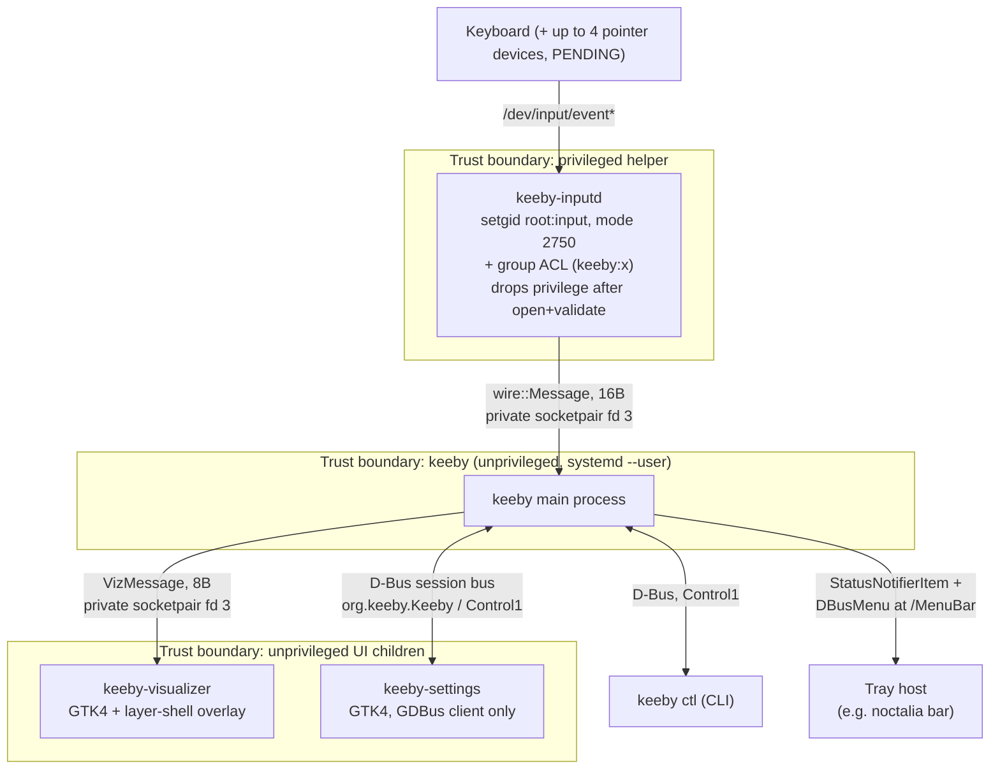
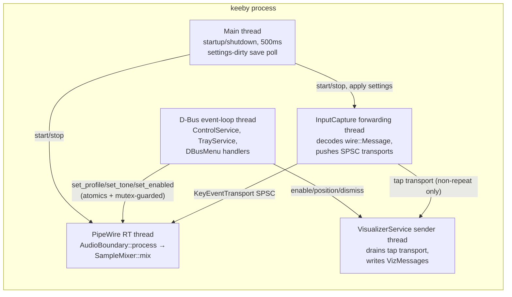
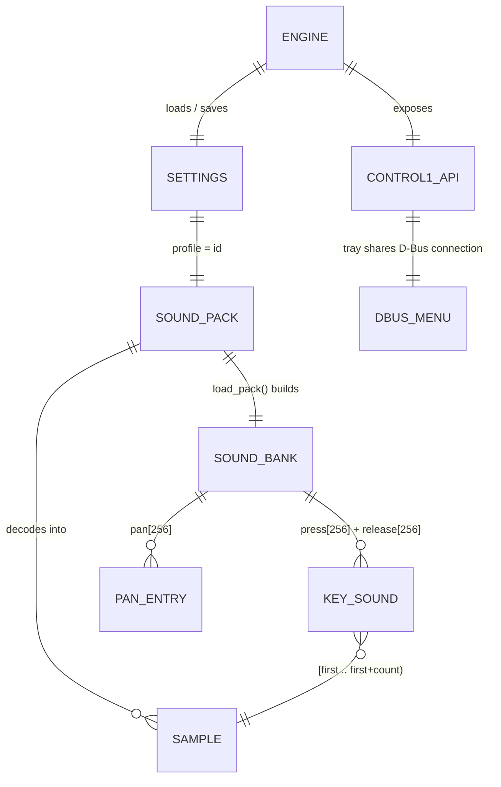
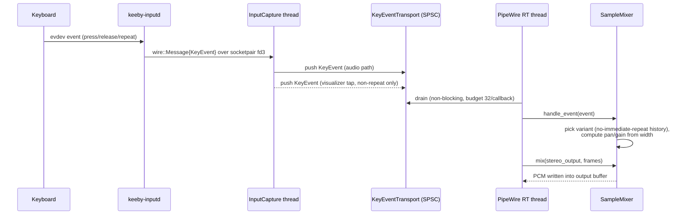
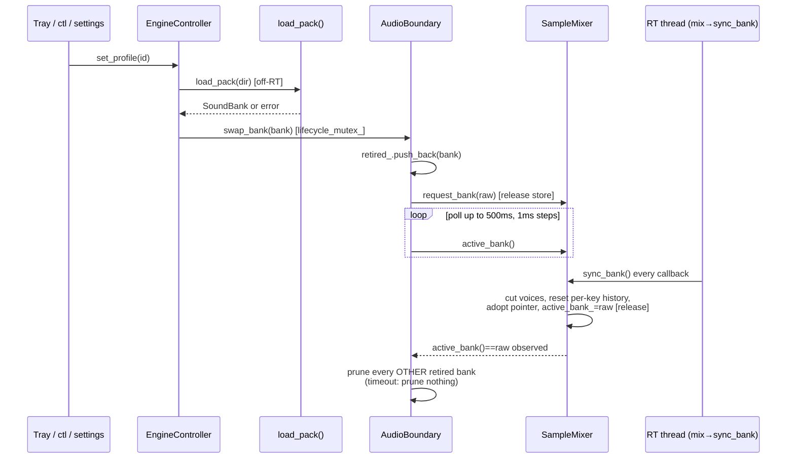
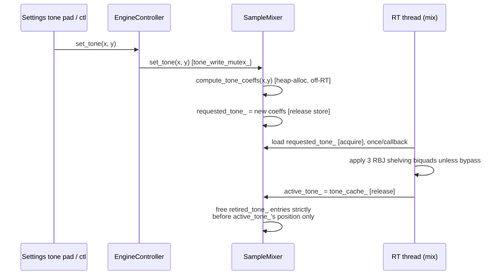
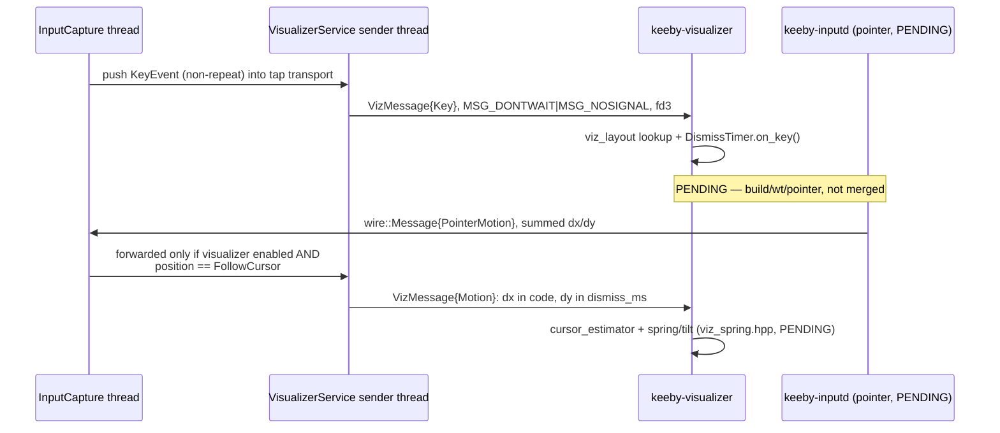
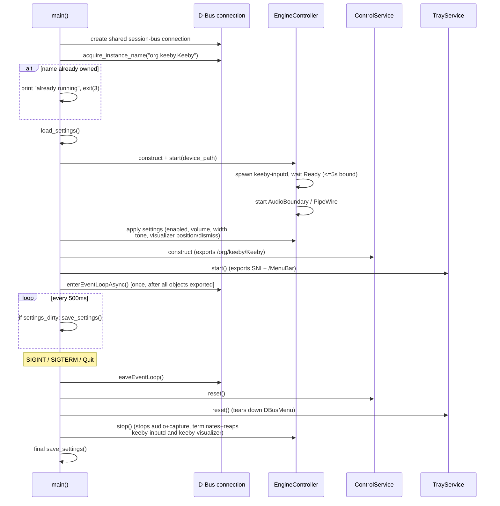
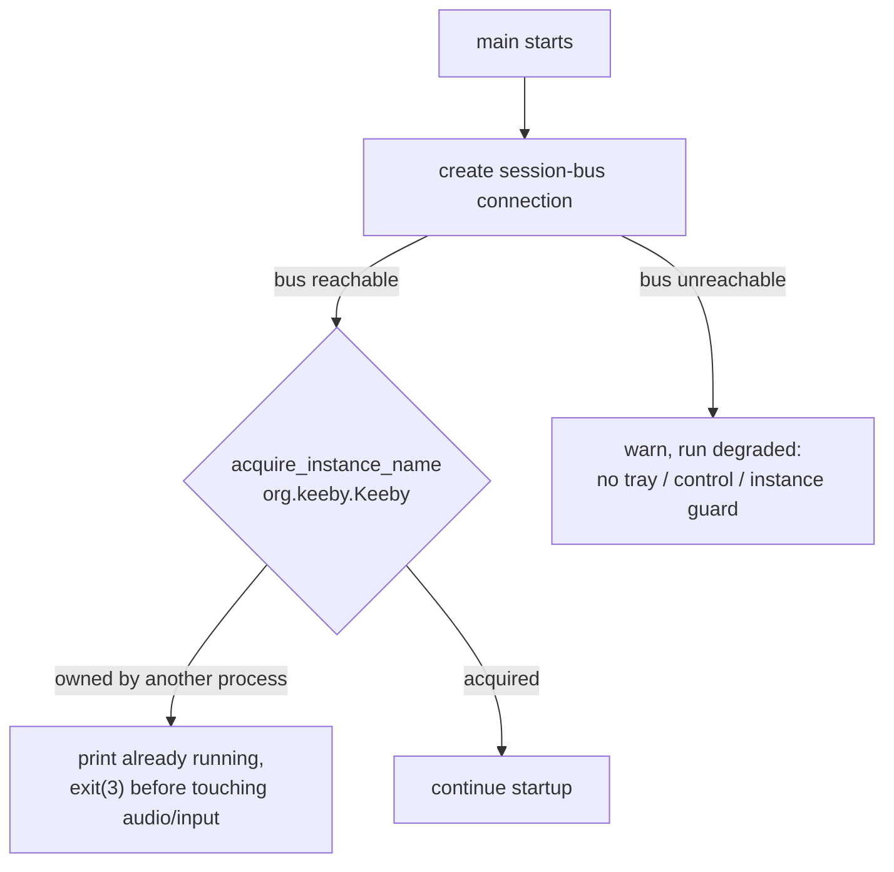
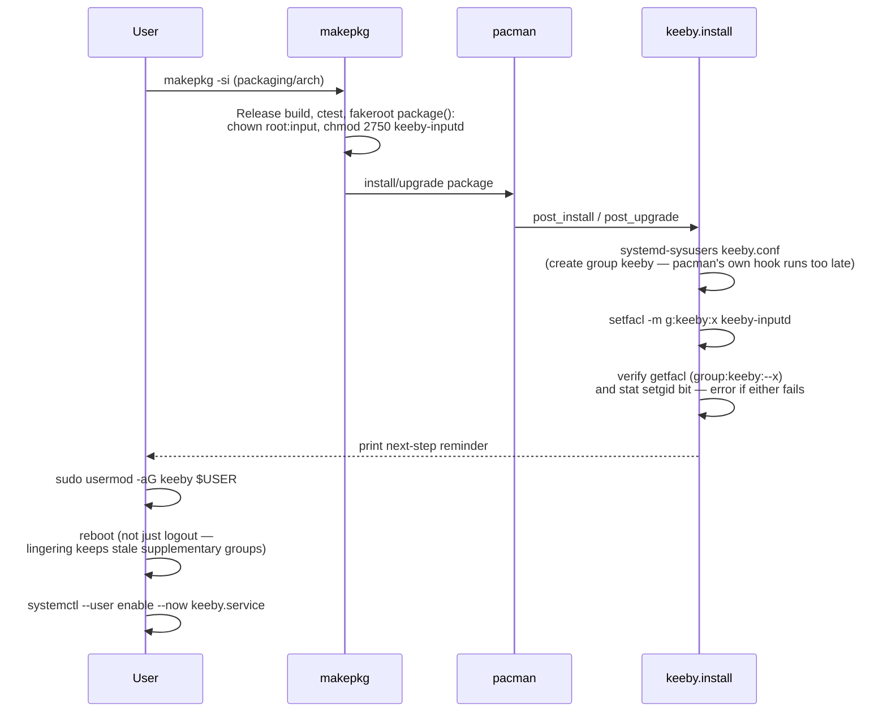

# KEEBY — System Design Document

Status: 2026-09-26, matching HANDOFF.md. KEEBY is a Linux-native clone of
[Keeby](https://getkeeby.com/) (mechanical-keyboard typing sounds), built for
the user's own machine (CachyOS/Arch + Niri Wayland compositor + noctalia bar).
Everything below is grounded in the current source tree, `docs/006`–`013`,
and `HANDOFF.md`. Anything not yet merged is explicitly marked **PENDING**.

---

## 1. System context, goals, constraints

**What it does**: plays a mechanical-keyboard sound on every keystroke
(press and release, per-key, stereo-panned, tone-shaped), shows an optional
floating on-screen keyboard overlay, and exposes control via a tray icon, a
GTK4 settings window (`keeby-settings`), and a CLI (`keeby ctl`).

**Platform constraints**:
- **Wayland/Niri**: no global window placement API and no global cursor
  position for an ordinary client — this is *why* the visualizer's
  follow-cursor feature needs cursor *estimation* rather than a real query
  (see §9, ADR "cursor estimation"). The overlay uses `gtk4-layer-shell` to
  place itself without a compositor-specific protocol.
- **Real-time audio**: the PipeWire audio callback (`AudioBoundary::process`,
  invoked from `on_process`) must never allocate, lock, call into the
  filesystem, log, or throw — verified per merge under Release + ASAN/UBSAN +
  TSAN (HANDOFF §5). Every RT-adjacent design in this document (bank swap,
  tone-coefficient publish) exists specifically to satisfy this constraint.
- **Keystroke confidentiality**: raw keystrokes are treated as
  confidentiality-sensitive throughout (passwords, codes, terminal commands).
  Only `keeby-inputd` ever opens `/dev/input/*`; keystroke data is **never**
  sent over D-Bus or any named/pathname socket — only over private,
  process-pair-only `AF_UNIX SOCK_SEQPACKET` sockets created by `socketpair()`
  immediately before `fork()` (docs/006 §1–3, docs/013 §1).

---

## 2. Architecture

### 2.1 Process diagram

Nothing crosses from B3 back into B1 or B2 except D-Bus control calls
(settings/ctl) and the two narrow wire protocols (keystroke code + down/up,
config values) — never a keystroke's context, never a password.

### 2.2 Threads inside `keeby`

Each of `keeby-settings` and `keeby-visualizer` is its own single-process,
single-(GLib/GTK)-main-loop program with no engine code linked in
(docs/012 §1, docs/013-visualizer-app.md).

### 2.3 Privilege model

`keeby-inputd` is the *only* process that opens `/dev/input/*`. It is
installed `root:input`, mode `2750` (`-rwxr-s---`), not setuid, no Linux
capabilities. Execute access beyond `root`/`input` is granted by a **group
ACL** (`setfacl -m g:keeby:x`) on a dedicated `keeby` system group created via
`systemd-sysusers` — chosen over the earlier per-username ACL (docs/006
§39–45) because a PKGBUILD scriptlet cannot hardcode a username (docs/010
§7). The ACL is re-applied on every `post_upgrade` because pacman replaces
the file (new inode) and a POSIX ACL lives on the inode, not the path.

**Drop order** (`keeby-inputd`, docs/006 §26–27), the last thing that happens
before any data can flow to the parent:
1. `setresgid(real_gid, real_gid, real_gid)` — drop to the invoking user's
   real GID; verified via `getresgid()`, dies if not confirmed or if `input`'s
   GID is still present in real/effective/saved.
2. `setgroups(1, &real_gid)` — best-effort clear of supplementary groups
   (expected `EPERM` without `CAP_SETGID`; non-fatal).
3. `prctl(PR_SET_NO_NEW_PRIVS, 1)`, `prctl(PR_SET_DUMPABLE, 0)`.
4. Only then: one `wire::Message{Ready}` to the parent.

`keeby` itself never requests elevated privilege and never becomes an
`input`/`keeby`-group member — it only creates the socket pair and execs the
helper (docs/006 §24).

**Live state** (HANDOFF §4): verified — no gid 992 (`input`) in either
process, zero capabilities, `NoNewPrivs 1`, and the SIGUSR1 self-test reports
"post-drop open() failed as expected (EACCES)". Note: `docs/006` itself still
records its last formal verdict as `BLOCKED` (§45, written before this later
live check) pending exactly this evidence — treat the HANDOFF entry as the
newer, authoritative status.

**PENDING**: the reviewed-but-unmerged pointer-motion patch
(`build/wt/pointer.patch`, HANDOFF §6a) widens `keeby-inputd` to also open up
to 4 pointer devices (motion-only, read before the privilege drop) so the
visualizer can estimate cursor position. `docs/006` does not yet have the
"pointer motion for the visualizer" security section HANDOFF §6a calls for —
this is a known documentation gap, not yet written.

---

## 3. Component catalog

| Module | Process | Responsibility | Key public API | Thread |
|---|---|---|---|---|
| `input_wire.hpp` | shared | Fixed 16-byte ABI, keeby-inputd ↔ keeby | `wire::Message`, `MessageType{Ready,KeyEvent}` | n/a (types only) |
| `visualizer_wire.hpp` | shared | Fixed 8-byte ABI, keeby ↔ keeby-visualizer | `viz::VizMessage`, `MessageType{Key,Config}`, `Position` | n/a |
| `input_capture.hpp` | keeby | Spawns `keeby-inputd`, decodes wire messages, feeds transports | `start/stop/connected/set_visualizer_transport` | owns the forwarding thread |
| `audio_boundary.hpp` | keeby | Owns the PipeWire stream/RT thread; forwards control calls to `SampleMixer` | `start/stop/set_enabled/set_master_gain/set_tone/swap_bank` | owns the RT thread (`on_process`) |
| `sample_mixer.hpp` | keeby | RT-safe voice mixing; bank and tone hot-swap | `handle_event/mix/set_tone/request_bank/sync_bank` | `mix()`/`handle_event()` on RT thread; setters callable from any thread |
| `sound_pack.hpp` | keeby | Off-RT Mechvibes pack discovery/loading | `load_pack`, `list_packs` | caller's thread (main/D-Bus) |
| `settings.hpp` | keeby | `settings.ini` load/save | `load_settings`, `save_settings` | main thread |
| `engine_controller.hpp` | keeby | Orchestrates transport/audio/capture/visualizer; RT-safe profile switch | `start/stop/set_profile/set_tone/set_visualizer_*` | main + D-Bus threads (guarded by `lifecycle_mutex_`/`profile_mutex_`) |
| `control_service.hpp` | keeby | `org.keeby.Control1` D-Bus service + `keeby ctl` client | `ControlService`, `acquire_instance_name`, `run_ctl` | D-Bus event-loop thread |
| `tray_service.hpp` | keeby | StatusNotifierItem + tray-menu build/dispatch logic (pure, unit-testable) | `TrayService`, `build_tray_menu`, `dispatch_tray_menu_click` | D-Bus event-loop thread |
| `dbus_menu.hpp` | keeby | `com.canonical.dbusmenu` object at `/MenuBar` | `DBusMenu`, `MenuItem`, `build_menu_layout` | D-Bus event-loop thread |
| `visualizer_service.hpp` | keeby | Spawns/manages `keeby-visualizer`; sends `VizMessage`s | `set_enabled/set_position/set_dismiss_ms/transport` | owns a dedicated sender thread |
| `ui/app.hpp`, `kbus_client.hpp`, `settings_logic.hpp`, `sound_controls.hpp`, `systemctl.hpp`, `tabs.hpp` | keeby-settings | GTK4 window; async `Control1` client; pure tone-pad/brand-grouping/throttle logic | `build_window`, `KeebyClient`, `pixel_to_tone`, `Throttle` | GTK/GLib main thread (async D-Bus, never blocks) |
| `visualizer/viz_dismiss.hpp`, `viz_layout.hpp`, `viz_position.hpp` | keeby-visualizer | Pure show/hide state machine, 60%-layout key-rect table, position↔anchor mapping | `DismissTimer`, `kLayout`/`find_key`, `anchor_for_position`/`is_valid_message` | GTK/GLib main thread |

---

## 4. ERD / data model

**SoundBank / Sample / KeySound** (`src/sample_mixer.hpp`):

| Type | Field | Notes |
|---|---|---|
| `Sample` | `pcm: vector<float>` | interleaved stereo, owned outside the RT path |
| `KeySound` | `first: uint16`, `count: uint8` | index + run length into `samples`; `count==0` = silent |
| `SoundBank` | `samples: vector<Sample>` | all PCM for the pack |
| | `press[256]: KeySound` | per raw evdev code (0..255) |
| | `release[256]: KeySound` | per raw evdev code |
| | `pan[256]: float` | `[-1, 1]`, default 0 (center) |

**PackInfo** (`src/sound_pack.hpp`): `id: string`, `name: string`,
`dir: path` (empty for the synthetic built-in `"default"` entry).

**Mechvibes `config.json` → KEEBY mapping** (docs/008):

| JSON field | Meaning | Mapping |
|---|---|---|
| `id`, `name` | pack identity | `PackInfo.id` / `.name` |
| `key_define_type` | `"single"` (one sprite, sliced) or `"multi"` (per-file) | selects `load_pack`'s single/multi path |
| `version` | absent/`1`: no release sounds, no fallback for undefined keys. `2`: adds pack-wide default `sound`/`soundup` + per-key release via `"<code>-up"`. `>=3`: rejected | `SoundBank.press`/`.release` population rule |
| `sound` / `soundup` | v2 multi-mode pack-wide default press/release | fallback `KeySound` for any key without its own define |
| `defines[code]` | `[start_ms, duration_ms]` (single) or `"relative/file{lo-hi}.ext"` (multi) | resolved via `map_mechvibes_code`, decoded, pitch-varied (0.92x/1.08x) into `Sample`s |
| `defines["<code>-up"]` | release sound for that key (both modes, v2 only) | `SoundBank.release[code]` |

**Settings** (`src/settings.hpp`, `settings.ini`):

| Key | Type | Range | Default |
|---|---|---|---|
| `enabled` | bool | — | `true` |
| `volume` | float | `[0, 1]` | `1.0` |
| `stereo_width` | float | `[0, 2]` | `1.0` |
| `profile` | string | any loadable pack id | `"default"` |
| `tone_x` | float | `[-1, 1]` | `0.0` (Thock↔Clack) |
| `tone_y` | float | `[-1, 1]` | `0.0` (Warm↔Bright) |
| `visualizer` | bool | — | `true` |
| `visualizer_position` | string | one of `viz::kPositionStrings` | `"bottom-center"` |
| `visualizer_dismiss_ms` | uint16 | `[250, 5000]` | `1000` |
| `visualizer_follow_speed` **(PENDING)** | double, 0.1 steps | `[1, 40]` (i.e. 0.1–4.0) | `10` (i.e. 1.0) — HANDOFF §6a |

A missing file yields defaults silently; a malformed value keeps the
default/clamps and appends a warning rather than failing the whole load.

**Wire `Message`** (`src/input_wire.hpp`, 16 bytes, `keeby-inputd` → `keeby`):

| Field | Type | Meaning |
|---|---|---|
| `type` | uint8 | `Ready=0`, `KeyEvent=1` (**PENDING**: `PointerMotion=2`, per HANDOFF §6a) |
| `kind` | uint8 | `KeyEvent` only: `0=Up, 1=Down, 2=Repeat` |
| `code` | uint16 | `KeyEvent` only: raw evdev `KEY_*` code |
| `reserved` | uint32 | always zero today (**PENDING**: packs summed per-frame dx/dy for `PointerMotion`) |
| `ts_ns` | uint64 | `KeyEvent` only: `CLOCK_MONOTONIC` nanoseconds |

**VizMessage** (`src/visualizer_wire.hpp`, 8 bytes, `keeby` ↔ `keeby-visualizer`):

| Field | Type | Meaning |
|---|---|---|
| `type` | uint8 | `Key=1`, `Config=2` (**PENDING**: `Motion=3`) |
| `kind` | uint8 | `Key` only: `1` down, `0` up (repeat never sent) |
| `code` | uint16 | `Key` only: raw evdev code (**PENDING**: `Motion`: dx, int16 bit-cast) |
| `position` | uint8 | `Config` only: `Position` 0..5 |
| `reserved` | uint8 | always zero today (**PENDING**: `Config` carries `follow_speed`, 0.1 steps, 1..40) |
| `dismiss_ms` | uint16 | `Config` only: `250..5000` (**PENDING**: `Motion`: dy, int16 bit-cast) |

`Position`: `TopLeft=0, TopCenter=1, TopRight=2, BottomLeft=3,
BottomCenter=4, BottomRight=5` (**PENDING**: `FollowCursor=6`, the new
default once merged — HANDOFF §6a).

**`org.keeby.Control1`** (bus `org.keeby.Keeby`, path `/org/keeby/Keeby`):

| Member | Signature | Notes |
|---|---|---|
| `Toggle` | `() → ()` | flip `enabled` |
| `SetEnabled` | `(b) → ()` | |
| `SetVolume` | `(d) → ()` | callee clamps `[0,1]` |
| `SetStereoWidth` | `(d) → ()` | callee clamps `[0,2]` |
| `SetProfile` | `(s) → ()` | error → `org.keeby.Error.ProfileFailed` |
| `ListProfiles` | `() → as` | ids only |
| `ListProfilesDetailed` | `() → a(ss)` | `(id, display name)` pairs, same order |
| `GetState` | `() → (b,d,d,s)` | enabled, volume, stereo_width, profile |
| `GetTone` / `SetTone` | `() → (dd)` / `(dd) → ()` | non-finite → `org.keeby.Error.InvalidArgument`; else clamped `[-1,1]` |
| `GetInfo` | `() → (s,b)` | version string, `device_connected` |
| `GetVisualizer` | `() → (b,s,u)` | enabled, position string, dismiss_ms (**PENDING**: `(b,s,u,d)` adding `follow_speed`) |
| `SetVisualizer` | `(b) → ()` | |
| `SetVisualizerPosition` | `(s) → ()` | unrecognized string → `org.keeby.Error.InvalidArgument` |
| `SetVisualizerDismiss` | `(u) → ()` | clamped `[250,5000]` |
| `SetVisualizerFollowSpeed` **(PENDING)** | `(d) → ()` | HANDOFF §6a, not merged |
| `Quit` | `() → ()` | |
| `StateChanged` (signal) | `()` | emitted after any mutating call, via one shared `refresh_and_mark_dirty()` |

**DBusMenu item model** (`src/dbus_menu.hpp`, `com.canonical.dbusmenu` at
`/MenuBar`):

| Field | Type | Notes |
|---|---|---|
| `id` | int32 | unique, `>0` (`0` reserved for the implicit root) |
| `label` | string | |
| `kind` | `Standard\|Separator\|Checkmark\|Radio` | |
| `enabled`, `visible`, `checked` | bool | `checked` only meaningful for Checkmark/Radio |
| `children` | `vector<MenuItem>` | non-empty ⇒ submenu |

Layout is served as `MenuLayout = Struct<int32, map<string,Variant>,
vector<Variant>>` (each child boxed in its own `Variant`, since sdbus-c++
needs a concrete type for a recursive D-Bus type). Stable top-level tray ids
(docs/009 §3, docs/011 §4): Sound on=1, Volume submenu=10 (presets 11–14),
Switches submenu=30 (packs at `100+index`, brand headers from `1000`), Stereo
width submenu=20 (presets 21–25), Visualizer=50/51 (position tiles 52–57),
separator=40, Settings…=42, Quit=41.

---

## 5. Key flows

**Keystroke → sound:**

**Profile switch (RT-safe bank swap with ack/retire, docs/008):**

**Tone change (coefficient publish, docs/011):**

**Visualizer key and motion forwarding (docs/013; motion is PENDING):**

**Startup and shutdown order (docs/009 §7, main.cpp):**

**Single-instance guard (docs/009 §6):**

**Install/upgrade (sysusers + ACL, docs/010 §7–8):**

---

## 6. User journeys

**Install and first run:**
1. `cd packaging/arch && makepkg -si`
2. `sudo usermod -aG keeby $USER`
3. **Reboot** — not just log out/in. If `loginctl show-user $USER -p Linger`
   is `yes`, the systemd `--user` manager survives a logout and keeps its
   stale supplementary groups; only a reboot (or
   `sudo systemctl restart user@<uid>.service`, which ends the graphical
   session) picks up the new `keeby` group (docs/010 §12).
4. `systemctl --user enable --now keeby.service`

**Daily typing**: type normally; `keeby-inputd` forwards events,
`keeby`'s RT thread plays samples, the tray icon reflects enabled/volume
state.

**Switching packs**: tray "Switches" submenu (grouped by brand), the
`keeby-settings` Sound tab's switch list, or `keeby ctl profile <id>` /
`keeby ctl profiles`. `keeby-fetch-packs` downloads community Mechvibes packs
into `~/.local/share/keeby/packs`.

**Tuning the tone pad**: drag the 2D pad in `keeby-settings`' Sound tab
(Thock/Clack on x, Warm/Bright on y); updates are throttled to ~30/s while
dragging, with the drag-end value always flushed via `SetTone`.

**Visualizer follow-cursor (PENDING)**: toggle the "Follow Cursor" tile in
the Visualizer tab and adjust the Follow Speed slider (or
`keeby ctl visualizer speed <x>`) — not merged yet (HANDOFF §6a/6b).

**Troubleshooting**:
- *Helper not executable*: check `getent group keeby` and
  `grep Groups /proc/$(pgrep -u $USER -xo systemd)/status` against it; a
  mismatch despite a fresh `id` means the running user-manager predates the
  group change — reboot, don't just relogin (docs/010 §12).
- *Service restart-looping*: `keeby.service` gives up after 5 starts in 60s
  (`StartLimitIntervalSec=60`, `StartLimitBurst=5`) instead of looping
  forever; fix the cause, then `systemctl --user reset-failed keeby.service`.
- *Validate installed packs*: `keeby --check-profiles` loads every profile
  without starting audio/input, catching a malformed pack early.

---

## 7. Security, RT-safety, error handling, testing

**Security** (full history in docs/006; summarized in §2.3 above): the
privileged-helper architecture was chosen over `input`-group membership,
udev ACLs, setuid/setcap, and direct-fd delegation after an explicit
decision checkpoint (docs/006 §5, §7). Residual, disclosed risks: any
process running as the same UID as a `keeby`-group member can execute the
helper directly (there is no per-application input-event ACL in the kernel
or in Wayland), and `keeby` itself is not sandboxed against `ptrace()`
(docs/006 §43). The pending pointer-motion widening (§2.3) still needs its
own security write-up.

**RT-safety invariants**: no allocation, locks, syscalls, or exceptions in
`AudioBoundary::process`/`SampleMixer::mix`; every cross-thread control value
is a lock-free atomic (`static_assert`-checked); bank and tone-coefficient
updates use a pointer-publish-and-retire scheme, not a fixed-size double
buffer — an earlier 2-slot buffer was proven racy under TSAN (a fast writer
can lap the reader inside one up-to-4096-frame callback); a fixed
per-callback event budget (`kMaxEventsPerCallback = 32`) bounds RT work
independent of producer rate.

**Error handling**: fallible off-RT operations return
`std::expected<T, std::string>` (`load_pack`, `load_wav_sample`,
`save_settings`, `EngineController::start/set_profile`, `TrayService::start`,
etc.); D-Bus handler exceptions are always turned into a D-Bus error reply
(`org.keeby.Error.InvalidArgument`, `org.keeby.Error.ProfileFailed`), never
left to escape the vtable dispatch; `keeby ctl` maps outcomes to exit codes
`0/1/2/64`.

**Testing strategy**: per-component ctest targets (`sample_mixer_test`,
`audio_boundary_test`, `input_capture_test`, `sound_pack_test`,
`settings_test`/`settings_logic_test`, `control_service_test`,
`engine_controller_test`, `dbus_menu_test`, `tray_menu_test`,
`kbus_client_test`, `visualizer_test`, `visualizer_service_test`), backed by
hermetic fakes (`fake_inputd.cpp`, `fake_keeby_service.cpp`,
`fake_keeby_visualizer.cpp`) so no real privilege or hardware is needed.
Every merge is checked under Release, ASAN/UBSAN, and TSAN (GLib-based D-Bus
tests excluded from TSAN — known false positives from GLib's internal thread
pool), per HANDOFF §5.

---

## 8. Deployment / packaging layout

| What | Installed path |
|---|---|
| `keeby` | `/usr/bin/keeby` |
| `keeby-inputd` | `/usr/lib/keeby/keeby-inputd` (`root:input`, mode `2750`, ACL `group:keeby:--x`) |
| `keeby-settings` | `bin/` (gated by `KEEBY_BUILD_SETTINGS_UI`, default ON) |
| `keeby-visualizer` | `bin/` (gated by `KEEBY_BUILD_VISUALIZER`, default ON) |
| Built-in assets | `/usr/share/keeby/assets/` |
| App icon | `/usr/share/icons/hicolor/scalable/apps/keeby.svg` |
| `keeby-fetch-packs` | `/usr/bin/keeby-fetch-packs` |
| systemd user unit | `/usr/lib/systemd/user/keeby.service` |
| Desktop entry | `/usr/share/applications/keeby.desktop` |
| sysusers fragment | `/usr/lib/sysusers.d/keeby.conf` (creates group `keeby`) |
| User packs | `~/.local/share/keeby/packs/` |
| Settings | `~/.config/keeby/settings.ini` (dir mode 0700, file mode 0600) |

---

## 9. Known limitations and design decisions (ADR-style)

- **Setgid helper, not `input`-group membership or setuid**: narrows a
  permanent, every-process credential down to one small, audited, short-lived
  process; alternatives (logind/udev ACL, setuid/setcap, direct fd
  delegation) were evaluated and rejected in docs/006 §5.
- **Group ACL over the original per-user ACL**: a PKGBUILD scriptlet can't
  hardcode a username; a `keeby` system group (via `sysusers`) lets any
  member run the helper and is re-appliable on every upgrade since the ACL
  lives on the file's inode, which pacman replaces wholesale (docs/010 §7).
- **Mechvibes `config.json` as KEEBY's own format**: reuses an existing,
  community-populated pack ecosystem instead of inventing a new one; it also
  doubles as KEEBY's own recording format (docs/008).
- **GTK4 without libadwaita**: libadwaita's GNOME look fights the intended
  Keeby-style dark/pill/card look; plain GTK4's C API leaves room for the
  hand-drawn volume pill and tone pad (docs/012 §1, §6).
- **Cursor estimation, not a real Wayland cursor query (PENDING)**: Wayland
  gives ordinary clients no global pointer position; the user chose to
  estimate it from summed pointer motion (drift expected, corrected at
  screen edges, tunable via Follow Speed) rather than requiring a
  compositor-specific protocol (HANDOFF §6).
- **Pointer-publish-and-retire over a fixed N-slot double buffer**: a 2-slot
  buffer for tone coefficients was proven racy under TSAN when a writer
  outpaces the RT reader inside one callback window (docs/011); the same
  pattern was already established for bank hot-swap (docs/008).
- **Known gaps, not yet built**: per-key configurator (switch/tone/volume per
  key), mouse-click sounds, and the 10 visualizer themes Keeby ships
  (HANDOFF §7); the ripple/spring/cursor-follow overlay work
  (`build/wt/overlay`) and the pointer-motion patch (`build/wt/pointer`) are
  both reviewed but **not merged** (HANDOFF §6a/6b); license is unchosen
  (`license=('custom')` placeholder, docs/010 §11); minor polish items (tray
  menu double-rebuild on some actions, `list_packs()` rescanning on every
  refresh, tray title showing the pack id instead of its display name) are
  tracked in HANDOFF §7.
